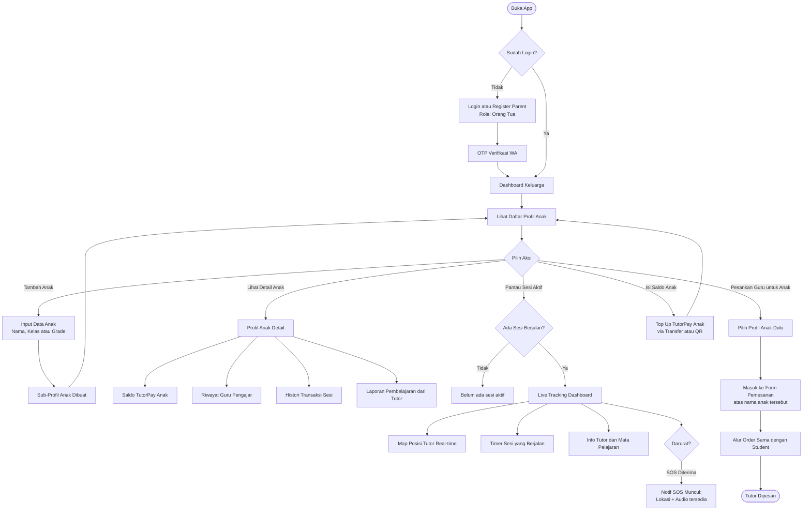
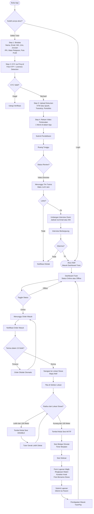
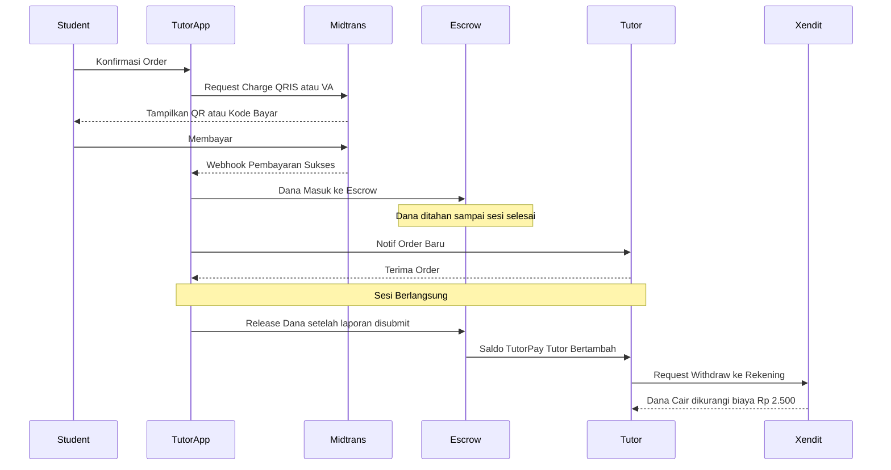

# Tutora App — Flowchart Lengkap Per Pengguna

Dokumen ini menggambarkan seluruh alur user journey per peran pengguna dalam Tutora App.

---

## 1. STUDENT — Alur Pemesanan & Belajar

```mermaid
flowchart TD
    A([Buka App]) --> B{Sudah Login?}
    B -- Tidak --> C[Welcome Screen]
    C --> D{Pilih Mode}
    D -- Daftar --> E[Register Student\nNama, Email, No HP, Password]
    D -- Login --> F[Login Screen\nEmail + Password]
    E --> G[OTP Verifikasi WhatsApp]
    G --> H{OTP Valid?}
    H -- Ya --> I[Dashboard Student]
    H -- Tidak --> G
    F --> I
    B -- Ya --> I

    I --> J[Home: Cari Tutor]
    J --> K[Form Pemesanan\nMata Pelajaran, Tingkat]
    K --> K1[Pilih Durasi:\n1 Jam atau 1.5 Jam]
    K1 --> K2[Pilih Paket:\n1 atau 4 atau 8 Sesi]
    K2 --> K3[Preferensi Gender Tutor]
    K3 --> K4{Tipe Booking?}
    K4 -- Sekarang --> K5[Lanjut]
    K4 -- Terjadwal --> K6[Pilih Time Slot]
    K6 --> K7{Slot 19.00-21.00?}
    K7 -- Ya --> K8[Flash Deal Malam\nDiskon 20% Otomatis]
    K7 -- Tidak --> K5
    K8 --> K5
    K5 --> L[Pilih Lokasi Penjemputan\nMaps + Cari Alamat]
    L --> M[Gunakan Promo/Voucher - Opsional]
    M --> N[Konfirmasi Harga\nSubtotal, Diskon, Grand Total]
    N --> O[Bayar via TutorPay atau QRIS]
    O --> P{Saldo Cukup?}
    P -- Tidak --> Q[Top Up TutorPay\nMinimarket atau Transfer]
    Q --> O
    P -- Ya --> R[Sedang Mencari Tutor\nAnimasi Radar]
    R --> S{Tutor Ditemukan?}
    S -- Timeout --> T[Tidak ada Tutor\nCoba Kembali]
    S -- Ya --> U[Tutor Menuju Lokasi\nLive Tracking Map + ETA]
    U --> V[Tutor Tiba\nNotifikasi Push]
    V --> W[Sesi Belajar Aktif\nTimer Countdown]
    W --> X{Emergency?}
    X -- SOS --> Y[Tombol SOS Merah:\nKirim GPS + Rekam Audio\nNotif ke Orang Tua]
    X -- Lanjut --> Z[Sesi Selesai]
    Z --> AA[Beri Ulasan dan Rating\n1-5 Bintang + Tag]
    AA --> AB([Selesai])
```

---

## 2. PARENT — Alur Dashboard Keluarga

---

## 3. TUTOR — Alur Registrasi, Onboarding & Mengajar

---

## 4. Alur Pembayaran & Escrow

